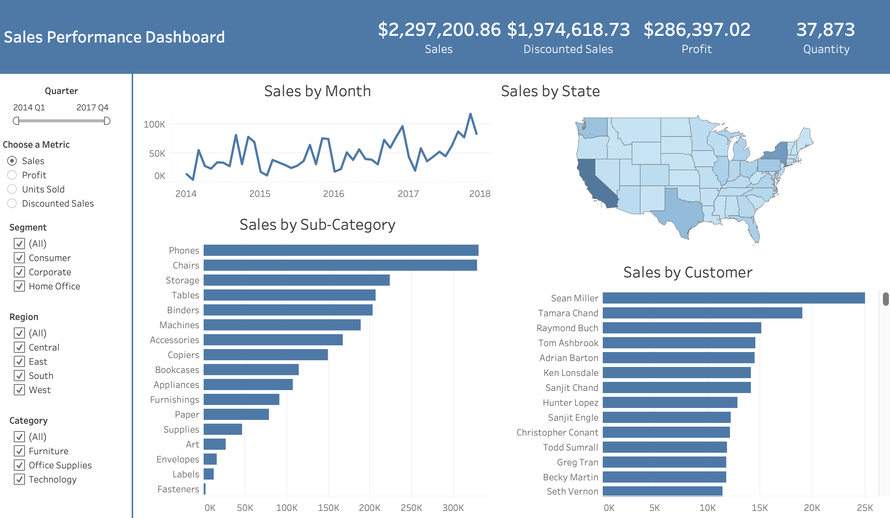

# **Sales Performance Dashboard** 📊💼

### *Data-Driven Insights for Smarter Business Decisions*

  

---

## **Project Overview** 🌍

The **Sales Performance Dashboard** is a comprehensive analytics project that transforms raw transactional data into actionable business insights. Using **Python**, **SQL**, and **Tableau**, this project analyzes over **9,900 sales records** from a global retail dataset to uncover trends in **customer behavior**, **product profitability**, and **regional sales performance**.

The goal is to empower business stakeholders to make **data-informed decisions** by visualizing KPIs such as revenue growth, profit margins, and discount impacts — all in a clear, interactive dashboard.

---

## **Key Skills Developed** 💡

* **Data Cleaning & Preprocessing** using *Pandas & NumPy* 🧹
* **Exploratory Data Analysis (EDA)** using *SQL, Matplotlib, & Seaborn* 🔍
* **SQL Query Development** for analytical insights 🗂️
* **Tableau Dashboard Design** for business intelligence visualization 📊
* **Data Integration** between *Python, SQL, and Tableau* 🔗
* **Analytical Thinking & Insight Communication** 🧠

---

## **Dataset Details** 📑

**Source:** [Tableau Public Sample Dataset](https://public.tableau.com/app/learn/sample-data)  
**Records:** 9,994  
**Features:** 21 columns (29 after data cleaning and processing)  
**Data Type:** Sales transactions with geographic, product, customer, and order information

### **Key Attributes:**

* **Customer Data:** `customer_id`, `customer_name`, `segment`
* **Geographic Data:** `country`, `state`, `city`, `region`
* **Order Details:** `order_date`, `ship_date`, `ship_mode`
* **Product Data:** `product_id`, `category`, `sub_category`, `product_name`
* **Financial Metrics:** `sales`, `discount`, `profit`, `profit_margin`, `discounted_sales`

---

## **Problem Statement** 🎯

Organizations often struggle to identify which products, customer segments, and regions drive the most profit.
This project seeks to answer key business questions such as:

* Which **customer segments and regions** are the most profitable?
* How do **discounts** affect overall profitability?
* What are the **top-performing products and categories**?
* How do **shipping methods and lead times** impact customer satisfaction?

---

## **Use Cases** 💼

* **Strategic Marketing:** Identify customer segments with high profitability for targeted promotions.
* **Inventory Planning:** Anticipate product demand and optimize stock levels.
* **Operational Efficiency:** Analyze lead times and shipping performance to improve delivery systems.
* **Revenue Optimization:** Adjust discount policies based on profitability trends.
* **Regional Strategy:** Pinpoint top-performing cities and states for expansion.

---

## **Approach** 🧭

1. **Data Cleaning & Preparation**

   * Removed duplicates, handled null values, standardized formats, and derived new columns (e.g., `profit_margin`, `discounted_sales`).
2. **SQL Data Loading**

   * Imported cleaned data into SQL tables for structured querying and relational analysis.
3. **Exploratory Data Analysis (EDA)**

   * Conducted multi-dimensional analyses on customers, sales, products, and orders using *Python* and *SQL*.
4. **Visualization in Tableau**

   * Built an **interactive business dashboard** for executives to monitor performance KPIs.
5. **Insight Generation**

   * Summarized findings into actionable recommendations for business decision-making.

---

## **Analysis Steps** 🔍

### **1. Customer Analysis** 👥

* **Demographic Distribution:** Identify high-performing regions and states.
* **Segment Performance:** Measure sales, profit, and order quantity by segment.
* **Geographic Insights:** Compare profitability across locations.
* **Purchase Patterns:** Track order frequency, preferred products, and profit trends.

### **2. Sales Analysis** 💰

* **Overall Performance:** Analyze revenue, profit, and quantity over time.
* **Profitability:** Determine high-margin products and categories.
* **Discount Impact:** Measure how pricing strategies affect profit.

### **3. Product Analysis** 📦

* **Top Products:** Rank by revenue and quantity sold.
* **Category Performance:** Evaluate sales by category and sub-category.
* **Product Trends:** Identify seasonal fluctuations and demand peaks.

### **4. Orders & Shipping Analysis** 🚚

* **Order Volume:** Assess business growth over months and years.
* **Shipping Mode Performance:** Compare modes by sales, profit, and delivery efficiency.
* **Lead Time Analysis:** Evaluate order-to-ship duration and its impact on satisfaction.

---

## **Results & Deliverables** 🏆

The project delivers a complete analytics pipeline, including:

* ✅ **Cleaned & Structured Dataset** ready for SQL queries
* 📘 **Comprehensive EDA Report** summarizing insights
* 💾 **SQL-based Analytical Scripts** for data retrieval
* 📊 **Interactive Tableau Dashboard** visualizing KPIs and trends
* 💡 **Actionable Business Insights** for profitability and efficiency improvements

---

## **Installation** ⚙️

### **Prerequisites:**

* Python 3.8+
* MySQL / PostgreSQL
* Jupyter Notebook or VS Code
* Tableau (for visualization)

### **Setup Steps:**

```bash
# Clone the repository
git clone https://github.com/markcelemen/sales-performance-dashboard.git
cd sales-performance-dashboard

# Install dependencies
pip install -r requirements.txt

# Run Jupyter Notebook
jupyter notebook
```

---

## **Usage** 🚀

1. Run the Jupyter notebooks to clean and preprocess the data.
2. Load the final dataset into your SQL database.
3. Use SQL scripts to perform analytical queries.
4. Connect Tableau to your database to visualize results.
5. Explore dashboard KPIs like revenue by region, product profitability, and discount effects.

---

## **Future Enhancements** 🔮

* **Predictive Analytics:** Forecast future sales using time-series models.
* **Customer Segmentation:** Apply clustering algorithms (e.g., K-Means) for marketing strategies.
* **Real-Time Dashboard:** Integrate live data updates using SQL triggers or APIs.
* **KPI Automation:** Auto-refresh Tableau dashboards via scheduled data extracts.
* **Advanced BI Integration:** Connect Power BI or Looker for enterprise-level reporting.

---

## **How to Contribute** 🤝

Contributions are welcome!

1. Fork the repository 🍴
2. Create a feature branch (`git checkout -b feature-branch`) 🌱
3. Commit your changes (`git commit -m 'Add feature'`) 📝
4. Push the branch (`git push origin feature-branch`) 🚀
5. Open a Pull Request 🔀
